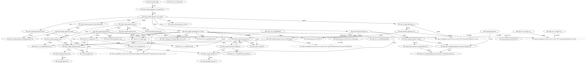

<!--
WARNING - The README.md file is generated from README.md.in and various data sources.  If you want to modify narrative text, modify README.md.in.  If results in tables need to be updated, please revise, or request revision to, the appropriate data files.
-->

## MIME Types

The following device MIME types were found in indexed datasets.

| ?lMimeType               |
|--------------------------|
| application/octet-stream |
| application/zip          |
| text/plain               |
| text/turtle              |

## Devices

The following device instances were found in indexed datasets.

| ?lManufacturerName      | ?lModel   | ?lDeviceClassLabels   | ?lDeviceType      | ?nDevice                                                                  |
|-------------------------|-----------|-----------------------|-------------------|---------------------------------------------------------------------------|
| Google LLC              |           |                       | OnHub wifi router | http://example.org/kb/device-650599c6-701f-4f2e-becb-74398b366ba3         |
| Raspberry Pi Foundation |           |                       | Raspberry Pi      | http://example.org/kb/device-8fe70491-26c5-4226-a735-ccda10e1a73a         |
| Samsung                 |           |                       | Smart things hub  | http://example.org/kb/device-6e718fd4-d876-4f81-8d58-10c21a741a70         |
| Samsung                 | SM-G925F  | Samsung SM-G925F      |                   | http://example.org/kb/samsung-device-2b5e3fe8-09a7-4c36-859a-5f669e7a1610 |

## Ontology import closure

CASE-Corpora imports multiple ontologies and other RDF schemata developed outside of the Cyber Domain Ontology.  The following illustration (click to see navigable SVG) shows how the various ontologies (/schemata) are imported.

The root of the imports is the CASE-Corpora knowledge base, which imports a shapes graph.  The imports then onward generally follow the pattern of shape graphs importing ontology (/schemata) graphs.

